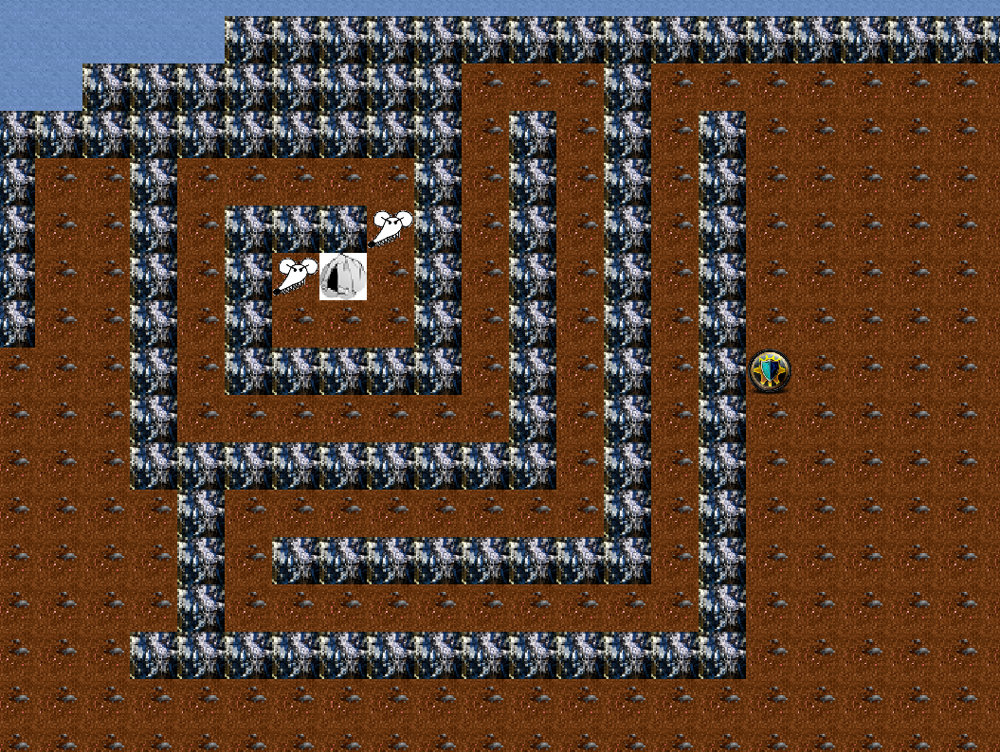
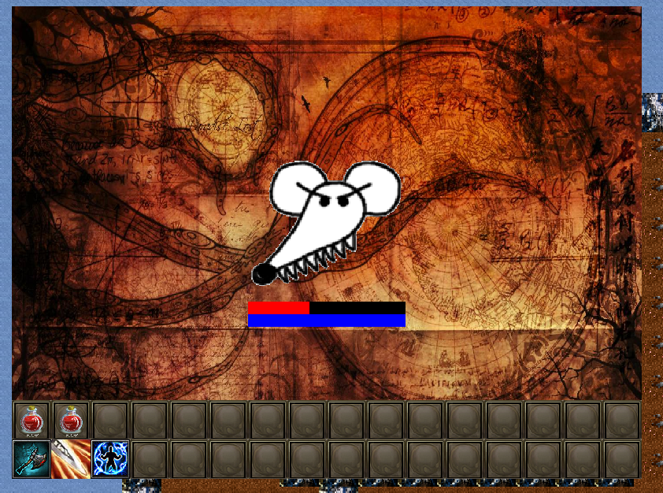

# fall-of-nouraajd
c++ dark fantasy game
  

## controls
<pre>
arrows - move
space - skip turn / close window
i - inventory
j - quest log
c - character sheet
s - save
tab - open/close python console
</pre>
## running
### ubuntu
<pre>
sudo apt install python3.11 python3.11-dev
./configure.sh
cd cmake-build-release
make _game
python3 play.py
</pre>
### testing
Run `python3 test.py` to execute the unit tests. Data validation tests run without
needing the compiled `_game` module, but other tests require it to be built.
