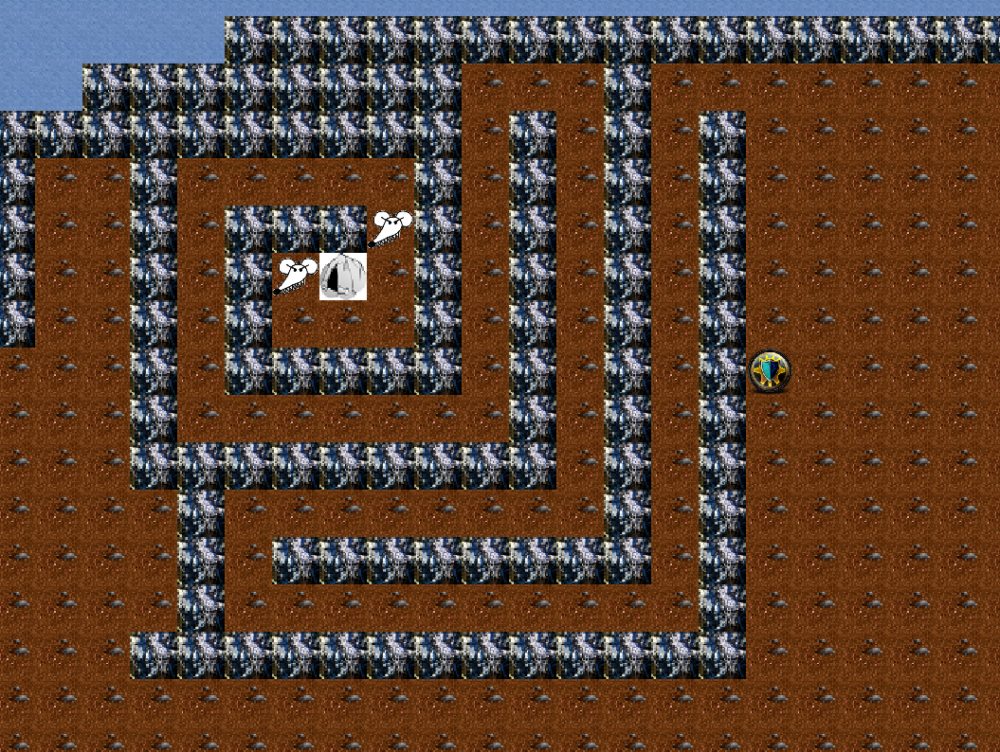
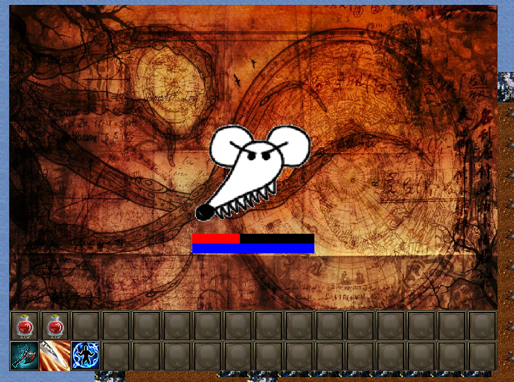

# fall-of-nouraajd
c++ dark fantasy game
  

## controls
<pre>
arrows - move
space - skip turn / close window
i - inventory
j - quest log
c - character sheet
s - save
tab - open/close python console
</pre>
## running
### ubuntu
<pre>
sudo apt-get install python3.11 python3.11-dev pybind11-dev nlohmann-json3-dev
./configure.sh
cmake --build cmake-build-release --target _game -j$(nproc)
python3 play.py
</pre>

### windows
Install Visual Studio 2022 with the **Desktop development with C++** workload and CMake tools, install Python 3.12,
then install and bootstrap vcpkg. From a normal `cmd.exe` shell:
<pre>
git clone https://github.com/microsoft/vcpkg C:\vcpkg
C:\vcpkg\bootstrap-vcpkg.bat
set VCPKG_ROOT=C:\vcpkg
python -m pip install --upgrade pillow
git submodule update --init --recursive
%VCPKG_ROOT%\vcpkg install --triplet x64-windows
configure.bat
cmake --build cmake-build-release --config Release --target _game
set GAME_BUILD_CONFIG=Release
python play.py
</pre>

### mcp server (engine api)
<pre>
cmake --build cmake-build-release --target _game -j$(nproc)
# start HTTP MCP server (defaults to 127.0.0.1:8765)
python3 mcp.py
# or build the extension on demand and run
python3 mcp.py --build
</pre>
The HTTP server exposes a unified `engine` surface from both `game` and `_game` via MCP tools:
- `engine_list`
- `engine_call`
- `engine_handle_call`

`engine_list` now includes pybind-backed class methods such as `CGameLoader.loadGame`,
`CGameLoader.loadGui`, and `CGameLoader.startGameWithPlayer`, so a client can build a
headless game session, call `CGuiHandler.openPanel("inventoryPanel")`, and dump the live
GUI tree with `jsonify(...)` without adding repo-specific MCP tools.

To use stdio transport instead (required by some Codex flows), run from the repository root:
<pre>
python3 mcp.py --stdio --repo-root . --build-dir cmake-build-release
</pre>
On Windows Visual Studio builds, add `--build-config Release`.
The command also works from `cmake-build-release/mcp.py` if you prefer launching from the build directory.

### testing
Running tests is **mandatory** after any code change.
From a fresh checkout, prepare the repository first:
<pre>
git submodule update --init --recursive
./configure.sh
</pre>

From the repository root, run:
<pre>
cmake --build cmake-build-release --target _game for_unit_tests -j$(nproc)
ctest --test-dir cmake-build-release --output-on-failure -R for_unit_tests
python3 test.py
</pre>
For Windows Visual Studio builds, use `--config Release`, pass `-C Release` to `ctest`,
and set `GAME_BUILD_CONFIG=Release` before running `python test.py`.
Also run `./scripts/run_coverage.sh` when a change touches tests (for example
`test.py` or `tests/unit/**`), `src/core/**`, `src/handler/**`, `src/object/**`,
or the coverage tooling. The total line coverage threshold for that run is 80%;
see `docs/testing.md` for details.
Data validation tests run without needing the compiled `_game` module, but
other tests require it to be built.
