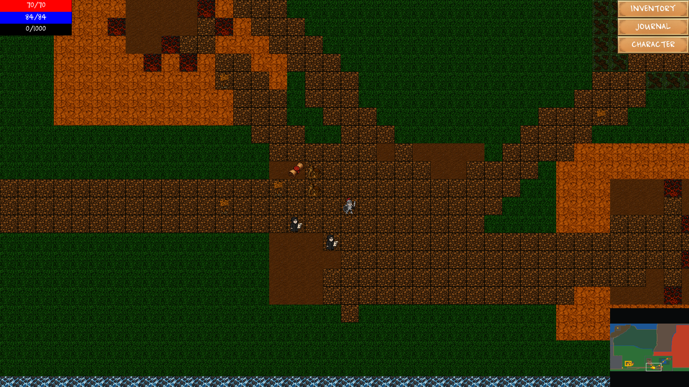
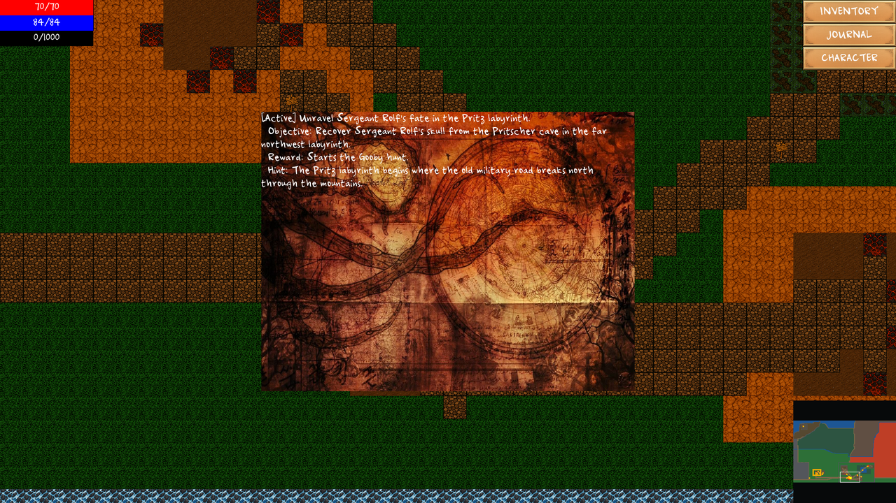
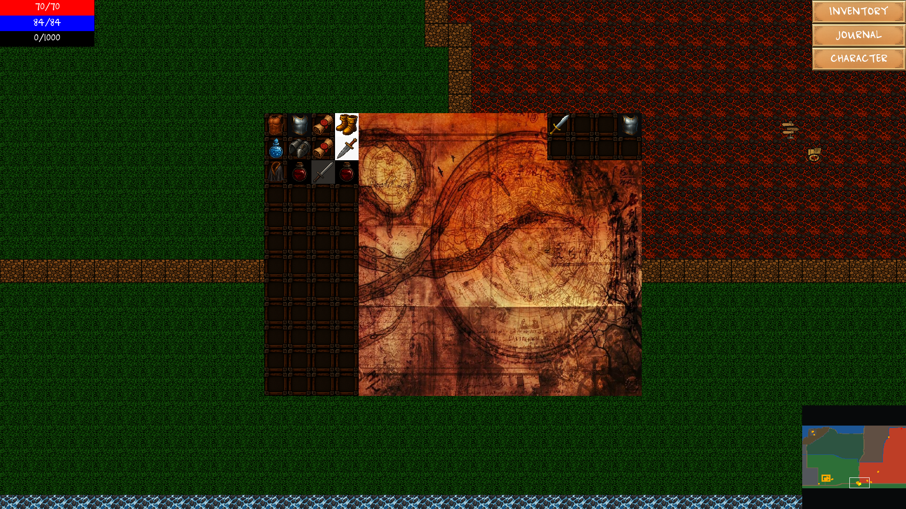
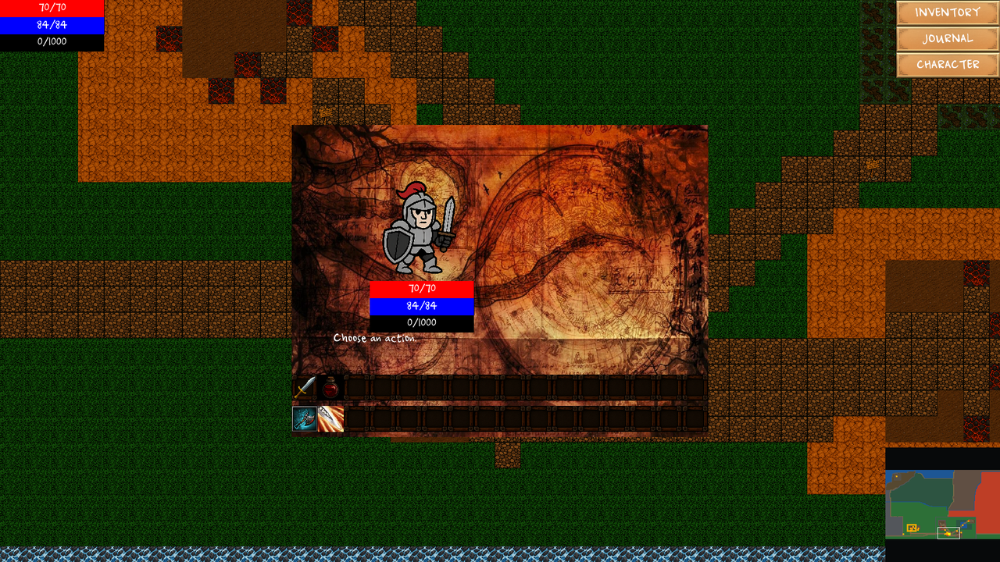

# fall-of-nouraajd
C++ dark fantasy 2D game with JSON-authored maps, Python plugins, SDL rendering, and a pybind11 `_game` engine module.

The current campaign centers on Nouraajd, a ruined town and surrounding wilderness with authored quest chains around
Sergeant Rolf, Mayor Irvin, Father Beren, Victor, cave contracts, and stolen relics. The game supports player-class
selection, turn-based movement and combat, inventory and equipment panels, quest journal objectives/rewards/hints,
story-gated crafting recipes, save/load, random maps, and an MCP engine API for headless inspection.

## screenshots
<p>
  
  
</p>
<p>
  
  
</p>

## features
- Explore authored maps such as Nouraajd, ritual, siege, and test maps, or start a random generated map.
- Choose from Warrior, Sorcerer, Assasin, Inquisitor, and Wayfarer player classes.
- Track active and completed quests in the journal, including objectives, rewards, and hints.
- Fight single or multi-enemy encounters with initiative, combat status text, loot, and quest-item protections.
- Manage inventory/equipment panels and craft potions or town-portal scrolls at story-unlocked stations.
- Drive the engine through the HTTP or stdio MCP server for automated inspection and walkthroughs.

## controls
```text
arrows - move
space - skip turn / close window
i - inventory
j - quest log
c - character sheet
s - save
tab - open/close python console when GAME_ENABLE_PYTHON_CONSOLE=1
```

## running
### ubuntu
`./configure.sh` installs the Ubuntu native dependencies used by the project and initializes submodules.

```sh
git submodule update --init --recursive
./configure.sh
cmake --build cmake-build-release --target _game -j$(nproc)
python3 play.py
```

### windows
Install Visual Studio 2022 with the **Desktop development with C++** workload and CMake tools, install Python 3.12,
then install and bootstrap vcpkg. From a normal `cmd.exe` shell:
<pre>
git clone https://github.com/microsoft/vcpkg C:\vcpkg
C:\vcpkg\bootstrap-vcpkg.bat
set VCPKG_ROOT=C:\vcpkg
python -m pip install --upgrade -r requirements-dev.txt
git submodule update --init --recursive
%VCPKG_ROOT%\vcpkg install --triplet x64-windows
configure.bat
cmake --build cmake-build-release --config Release --target _game
set GAME_BUILD_DIR=cmake-build-release
set GAME_BUILD_CONFIG=Release
set PATH=%CD%\cmake-build-release;%CD%\cmake-build-release\Release;%VCPKG_ROOT%\installed\x64-windows\bin;%PATH%
python play.py
</pre>

`python3 play.py` opens the start menu. `NEW` selects a map and player class, `LOAD` uses saved games, and `RANDOM`
starts a generated map.

### mcp server (engine api)
<pre>
cmake --build cmake-build-release --target _game -j$(nproc)
# start HTTP MCP server (defaults to 127.0.0.1:8765)
python3 mcp.py
# or build the extension on demand and run
python3 mcp.py --build
</pre>
The HTTP server exposes a unified `engine` surface from both `game` and `_game`. Core MCP tools include:
- `engine_list`
- `engine_call`
- `engine_handle_call`
- `map_design_brief`

`engine_list` now includes pybind-backed class methods such as `CGameLoader.loadGame`,
`CGameLoader.loadGui`, and `CGameLoader.startGameWithPlayer`, so a client can build a
headless game session, call `CGuiHandler.openPanel("inventoryPanel")`, and dump the live
GUI tree with `jsonify(...)` without adding repo-specific MCP tools.

To use stdio transport instead (required by some Codex flows), run from the repository root:
<pre>
python3 mcp.py --stdio --repo-root . --build-dir cmake-build-release
</pre>
On Windows Visual Studio builds, use:
<pre>
python mcp.py --stdio --repo-root . --build-dir cmake-build-release --build-config Release
</pre>

### testing
Running tests is **mandatory** after any code change.
From a fresh checkout, prepare the repository first:
<pre>
git submodule update --init --recursive
./configure.sh
python -m pip install --upgrade -r requirements-dev.txt
</pre>

From the repository root, run:
<pre>
python3 scripts/validate_content.py --repo-root .
python3 -m unittest tests.test_content_validator
cmake --build cmake-build-release --target _game for_unit_tests -j$(nproc)
ctest --test-dir cmake-build-release --output-on-failure -R for_unit_tests
python3 test.py
</pre>
For Windows Visual Studio builds, use `--config Release`, pass `-C Release` to `ctest`,
then set `GAME_BUILD_DIR=cmake-build-release` and `GAME_BUILD_CONFIG=Release` before running `python test.py`. Use
`python scripts/validate_content.py --repo-root .` and
`python -m unittest tests.test_content_validator` for the Windows content-validation
steps.
Also run `./scripts/run_coverage.sh` when a change touches tests (for example
`test.py` or `tests/unit/**`), `src/core/**`, `src/handler/**`, `src/object/**`,
or the coverage tooling. The default coverage run uses the Python reporter with
`scripts/coverage_exclusions.json` and enforces a 100% eligible-line gate; see
`docs/testing.md` for details, including recommended branch-protection checks.
Content JSON validation and its focused fixture tests run without needing the
compiled `_game` module, but other tests require it to be built.
`requirements-dev.txt` is the pinned source for pip-managed Python test tools
used by CI, Windows, and virtual environments. Linux native build dependencies,
including pybind11, still come from the OS packages installed by `./configure.sh`.
When using a pip-managed Python environment, run:
<pre>
python -m pip install --upgrade -r requirements-dev.txt
</pre>
